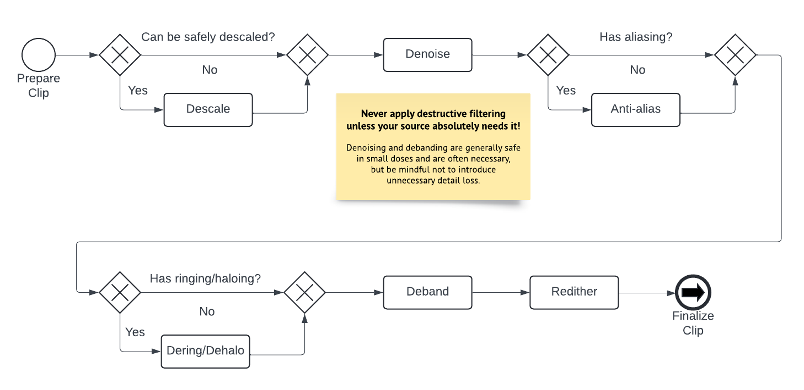

# Order of filtering operations

Deciding which filters to use is important,
but what's arguably even more important
is understanding which order to run filters in.

## Inverse filters

If you're running any filter
that does the inverse of a process
applied by the studio or authoring company,
such as a descale or lowpass filter,
you should almost *always*
perform those before any other filtering.
These types of filters rely on
the "state" of the video
being the same
or as close as possible
to the state when the filter was applied.

For example,
applying anti-aliasing before descaling
will modify the line art too much,
making it difficult to reverse accurately.
This may seem obvious,
but issues arise
when you intend to run *multiple* filters
that do the inverse of different operations.

A common example would be
an HD source that has been both upscaled and telecined.
The trick to dealing with these
is to imagine the original process.
In this example,
it's easy to imagine that telecining
depends on the interlacing being 1px tall.
Otherwise,
it wouldn't be reversible by a player.
This implies that,
from a production standpoint,
telecining must be performed last.
Therefore,
if you want to undo an upscale
on a telecined source,
you must IVTC (inverse telecine) first,
unless you have reason to believe
this was not the original order of operations.

Another example would be
a source that is lowpassed and telecined.
In this case,
you must do a bit more detective work,
as it could reasonably be done in either order.
If there's significant vertical ringing
that causes issues during inverse telecining,
you may have to address the frequency merging first.
However,
if your source only has horizontal ringing,
as is the case with many R2J DVDs,
the order of operations matters less.
This is because neither filter
will interfere with
how you would fix the artifact
the other is trying to resolve.

## Generic filtering

For most modern titles,
there's a generally accepted order
for applying filters in a filterchain:

### Descaling

!!! danger "Attention"
    **NEVER** descale a video unless you're *absolutely certain* your descale is correct.

Descaling and similar inverse operations
should be performed first
if the source can be safely descaled,
for reasons outlined previously.

### Denoising

Since every consumer source
contains some degree of compression noise,
denoising is recommended.
You may perform this step prior to descaling
if the studio or authoring company
added strong dithering in post
that interferes with descaling.
Early denoising can also speed up
certain filterchains.

### Anti-aliasing

!!! danger "Attention"
    A proper rescale will often deal with aliasing, ringing, and haloing artifacting.
    **NEVER** perform any of those three steps unless you're *absolutely* certain you must.

Noise around edges may affect anti-aliasing,
so perform this step after denoising.
Anti-aliasing should ideally be scene-filtered
because it's a highly destructive filter
and can significantly slow down
the filtering process.
Only perform this step if your source actually has aliasing.

### Deringing/Dehaloing

Many top anti-aliasing filters
might introduce mild ringing or haloing
under certain conditions.
It's safer to dering or dehalo
after anti-aliasing.
These are destructive processes,
so only use them when absolutely necessary.

### Debanding

Similar to denoising,
nearly every source exhibits
some degree of banding
due to compression.
Avoid excessive debanding
to prevent unnecessary detail loss.
A mild protective deband
can be beneficial
if minimal banding is present.

### Redithering

Redithering aids in preserving gradients during encoding,
especially since even 10-bit video
doesn't have enough color depth
to maintain all gradients flawlessly.
Debanding and denoising
may disrupt existing dither patterns,
causing them to appear "broken" or "splotchy".
Reapplying dither using a grain function
that mimics the source's pattern
can help smoothen out these issues.
It's always recommended to apply dynamic dithering,
even if the original source used static dithering.
